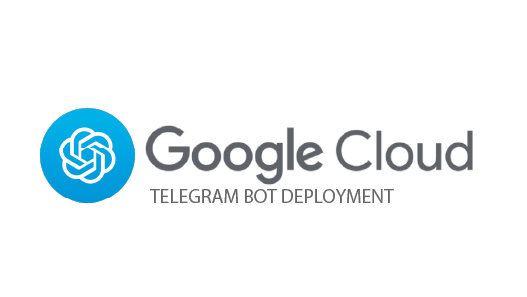
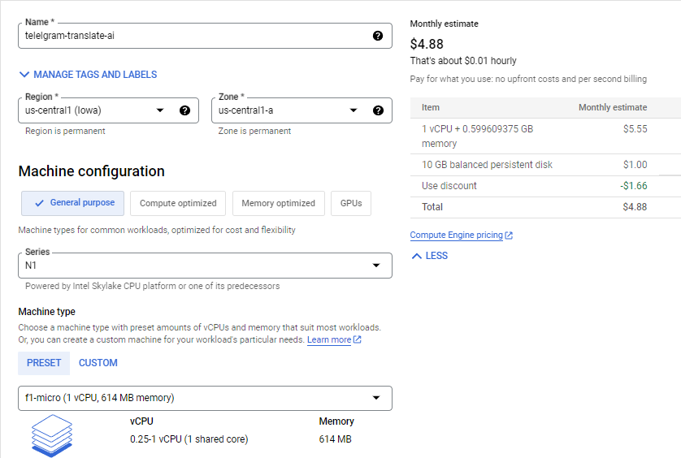
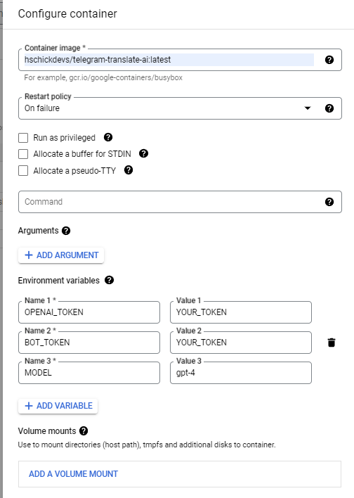

    

## The following guide will teach you how to deploy the bot to the cloud using Google Cloud, a robust and cost effective hosting service:

1. Create an account at https://cloud.google.com/, if you haven't already done so.

2. Set up your billing account at https://console.cloud.google.com/billing

    * Note that you may be eligible for $300 in free credit if this is your first Google Cloud account!

3. Enable the Compute Engine API at https://console.cloud.google.com/apis/library/compute.googleapis.com

4. Go to Compute Engine Instances at https://console.cloud.google.com/compute/instances

5. Click **Create Instance** in the menu

6. Verify or modify the following settings. If a setting is not mentioned, you should leave it as the default:

    1. Set the **Name** of the instance to whatever you'd like (e.g. _telegram-translate-ai_)

    2. Change the **Series** under _Machine configuration_ to **N1**
    
    3. Change the **Machine Type** under _Machine configuration_ to **Shared-core** -> **f1-micro**

        * Your monthly estimate after this should be around $4.88, as this is the cheapest machine series possible with Google Cloud.
        
        * Verify that your settings look like this so far:
            
        
    4. Click **DEPLOY CONTAINER** under _Container_ to deploy the docker container image to the instance.

    5. In the **Container image** box, enter: `hschickdevs/telegram-translate-ai:latest`

    6. Set the **Restart policy** to _On failure_

    7. Add the required environment variables for the bot by clicking **ADD VARIABLE** for each:

        * **OPENAI_TOKEN**: Set to your OPENAI API key which was created in the prerequisite step.

        * **BOT_TOKEN**: Set to your Telegram bot token which was also created in the prerequisite step.

        * **MODEL**: OPTIONALLY - You can set this environment variable if you'd like to use a different model. the default is `gpt-3.5-turbo`, but you can set this to `gpt-4` if applicable to your account.

    8. Verify that your settings in the **Configure container** look like this (The environment variables in the image are for example only, not real), then click **SELECT** at the bottom to save the settings:

        

    9. Lastly, under **Firewall** check the boxes for:
        - [X] **Allow HTTP traffic**
        - [X] **Allow HTTPS traffic**

7. Once you have finished creating these settings, click **CREATE** at the bottom of the menu.

8. Once the VM is finished provisioning and the status indicates a **green checkmark**, you can head to your bot's chat on Telegram and start using it!

For any questions, please contact me on Telegram: https://t.me/hschickdevs